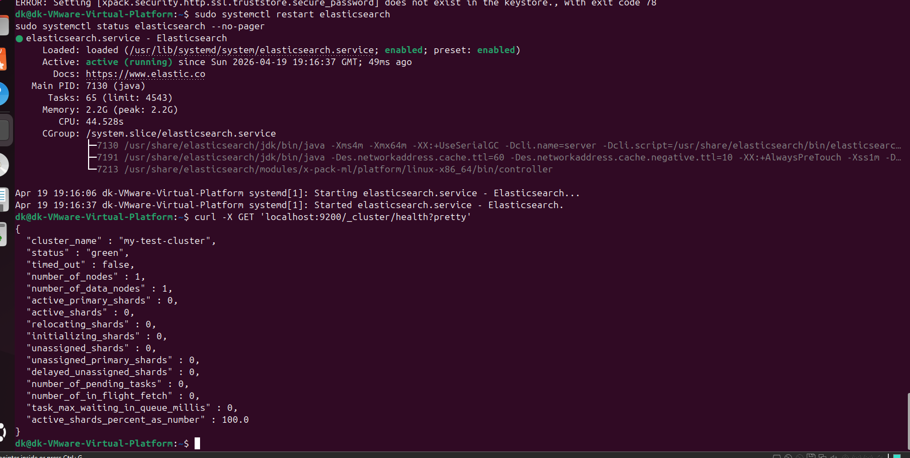

# Домашнее задание к занятию «ELK»

## Задание 1. Elasticsearch

Для выполнения задания я установил и запустил `Elasticsearch`, после чего изменил параметр `cluster.name` на произвольный.

После запуска выполнил проверку состояния кластера командой:

```bash
curl -X GET 'localhost:9200/_cluster/health?pretty'
```

В результате убедился, что Elasticsearch работает корректно, а в выводе отображается измененное имя кластера.


___

##  Задание 2. Kibana

Для выполнения задания я установил и запустил Kibana.

После запуска открыл веб-интерфейс Kibana и перешел в Dev Tools, где выполнил запрос:
```bash
GET /_cluster/health?pretty
```
В результате в интерфейсе Kibana отобразился ответ от Elasticsearch с информацией о состоянии кластера.

Скриншот

___

## Задание 3. Logstash

Для выполнения задания я установил и запустил Logstash и Nginx.

Сначала проверил работу Nginx и сгенерировал несколько запросов к веб-серверу, чтобы в файле /var/log/nginx/access.log появились записи.

После этого создал конфигурационный файл Logstash, в котором настроил:

чтение файла /var/log/nginx/access.log;
отправку логов в Elasticsearch в индекс nginx-logs.

Далее запустил Logstash и убедился, что данные начали поступать в Elasticsearch.

Для проверки открыл Kibana, создал Data View nginx-logs* и в разделе Discover убедился, что логи Nginx отображаются в интерфейсе.

Скриншот

___

## Задание 4. Filebeat

Для выполнения задания я установил и запустил Filebeat.

После этого отключил Logstash и настроил Filebeat на чтение логов Nginx из файла /var/log/nginx/access.log с последующей отправкой данных напрямую в Elasticsearch.

Далее выполнил проверку конфигурации, запустил сервис Filebeat и сгенерировал несколько запросов к Nginx, чтобы в логах появились новые записи.

После этого в Kibana открыл Discover, выбрал Data View filebeat-* и убедился, что логи Nginx успешно отображаются в интерфейсе.

Скриншот

___

## Вывод

В ходе выполнения домашнего задания я установил и проверил работу основных компонентов стека ELK.

Я выполнил:

установку и запуск Elasticsearch;
установку и запуск Kibana;
отправку логов Nginx в Elasticsearch через Logstash;
отправку логов Nginx в Elasticsearch через Filebeat.

В результате я на практике посмотрел, как можно собирать, передавать и анализировать логи через инструменты стека ELK.
